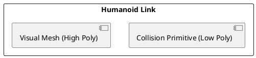

# Lesson 1: Simulating Physics, Gravity, Collisions in Gazebo - Gazebo Simulation Environment Setup

Welcome to Lesson 1 of Module 2, where we begin our practical journey into the realm of digital twins with **Gazebo**. Gazebo is a powerful 3D robot simulator that is widely used in the robotics community for its ability to accurately simulate complex physics, generate realistic sensor data, and provide robust environments for robot development and testing. Understanding how to set up and interact with Gazebo is fundamental for anyone working with physical AI, especially humanoids.

In this lesson, we will focus on the core aspects of Gazebo: its simulation environment setup, the critical role of physics engines, and how to effectively simulate fundamental physical phenomena like gravity and collisions. These elements are not just background; they are the bedrock upon which realistic robot behaviors and interactions are built.

## 1.1 Gazebo Simulation Environment Setup

Gazebo can be used standalone or, more commonly, integrated with ROS 2. For this textbook, we will primarily focus on its integration with ROS 2, which allows for seamless communication between your robot's software (written using `rclpy` or `rclcpp`) and the simulated world.

### Prerequisites for Gazebo Installation

*   **Ubuntu (Recommended for ROS 2 + Gazebo)**:
    1.  Ensure you have ROS 2 Iron Irwini installed (as discussed in Chapter 2). Gazebo usually comes with the ROS 2 desktop installation, specifically Gazebo Classic (version 11).
    2.  If Gazebo is not installed, you can install it via ROS 2: `sudo apt install ros-iron-gazebo-ros-pkgs`
    3.  For newer versions or Gazebo Garden/Fortress (next-gen Gazebo, post-Classic), follow their dedicated installation guides. As of 2025, Gazebo Classic 11 remains widely used, but Gazebo Garden/Fortress (with `gz` tools) is gaining traction. This lesson will primarily use Gazebo Classic concepts but mention `gz` tooling where relevant.

*   **Windows (via WSL2)**: Follow the Ubuntu installation steps within your WSL2 environment. X-server setup is crucial for GUI display.
*   **macOS (via Docker)**: Running Gazebo in Docker requires advanced X-server configuration for GUI applications due to the heavy graphical requirements. It's often more challenging than for simple ROS 2 nodes. For production scenarios, cloud-based Gazebo simulations or Linux VMs are often preferred on macOS.

### Launching Gazebo

A typical way to launch Gazebo with ROS 2 is via a launch file. We'll use a simple world for demonstration.

```python
# ~/ros2_ws/src/my_gazebo_pkg/launch/empty_world.launch.py
from launch import LaunchDescription
from launch.actions import IncludeLaunchDescription
from launch.launch_description_sources import PythonLaunchDescriptionSource
from ament_index_python.packages import get_package_share_directory
import os

def generate_launch_description():
    gazebo_ros_dir = get_package_share_directory('gazebo_ros')
    
    return LaunchDescription([
        IncludeLaunchDescription(
            PythonLaunchDescriptionSource(
                os.path.join(gazebo_ros_dir, 'launch', 'gazebo.launch.py')
            ),
            launch_arguments={'gazebo_args': '-s libgazebo_ros_factory.so'}.items()
        )
    ])
```
To run: `ros2 launch my_gazebo_pkg empty_world.launch.py`

This will open an empty Gazebo world. From here, you can insert models from the Gazebo Model Editor or programmatically.

## 1.2 Physics Simulation: Gravity and Collision Models

Gazebo utilizes a powerful physics engine (defaulting to ODE - Open Dynamics Engine, but also supporting Bullet, DART, and Simbody) to accurately mimic the laws of physics. Understanding how to configure these is vital for realistic humanoid behavior.

### Gravity

Gravity is a fundamental force in any realistic simulation. Gazebo allows you to define the gravity vector for your world. By default, it's set to approximately -9.8 m/s² in the Z-direction, mimicking Earth's gravity.

**World File Configuration (example in SDF - Simulation Description Format)**:
Gazebo worlds are typically defined in `.world` files using SDF (Simulation Description Format), which is a superset of URDF, capable of describing environments and multiple robots.

```xml
<?xml version="1.0"?>
<sdf version="1.6">
  <world name="default">
    <gravity>0 0 -9.8</gravity>
    <!-- Other world elements like sun, ground plane, etc. -->
    <include>
      <uri>model://sun</uri>
    </include>
    <include>
      <uri>model://ground_plane</uri>
    </include>
    <!-- ... other models ... -->
  </world>
</sdf>
```

### Collision Models

For a humanoid robot, accurate collision detection and response are paramount. Without it, robots would pass through objects or get stuck in physically impossible configurations.

*   **Simplified Geometries**: While visual models (used for rendering) can be highly detailed meshes, collision models are often simplified geometries (spheres, boxes, cylinders, capsules) to reduce computational load for physics calculations. The goal is to approximate the robot's physical boundaries.
*   **Collision `<geometry>` vs. Visual `<geometry>`**: In URDF/SDF, the `<collision>` tag specifies the shape for physics interactions, while `<visual>` specifies what is rendered. They can be (and often should be) different.
*   **Self-Collision**: Humanoids have many joints and links, making self-collision detection (e.g., an arm hitting the torso) critical for safe motion planning. This is typically configured in an SRDF file for motion planning frameworks like MoveIt, but the underlying collision geometries come from URDF/SDF.

### Diagram: Visual vs. Collision Geometry



## 1.3 Loading Humanoid Models into Gazebo

To bring your humanoid into Gazebo, you typically use a URDF/SDF model, which Gazebo parses.

### Using `spawn_entity.py`

ROS 2 provides a `spawn_entity.py` script from `gazebo_ros` package to easily insert URDF or SDF models into a running Gazebo simulation.

```python
# ~/ros2_ws/src/my_gazebo_pkg/launch/spawn_humanoid.launch.py
from launch import LaunchDescription
from launch.actions import DeclareLaunchArgument, ExecuteProcess
from launch.substitutions import LaunchConfiguration, Command
from ament_index_python.packages import get_package_share_directory
import os

def generate_launch_description():
    humanoid_description_dir = get_package_share_directory('my_humanoid_description')
    
    # Path to your humanoid URDF
    humanoid_urdf_path = os.path.join(humanoid_description_dir, 'urdf', 'my_humanoid.urdf')

    # Read the URDF file
    with open(humanoid_urdf_path, 'r') as infp:
        robot_description = infp.read()

    # Spawn robot in Gazebo
    spawn_entity = Node(
        package='gazebo_ros', 
        executable='spawn_entity.py',
        arguments=[
            '-topic', 'robot_description',
            '-entity', 'my_humanoid',
            '-x', '0.0',
            '-y', '0.0',
            '-z', '1.0' # Spawn above ground to observe gravity
        ],
        output='screen'
    )

    # Robot State Publisher (needed to parse URDF and publish joint states)
    robot_state_publisher_node = Node(
        package='robot_state_publisher',
        executable='robot_state_publisher',
        parameters=[{'robot_description': robot_description}],
        output='screen'
    )

    return LaunchDescription([
        robot_state_publisher_node,
        spawn_entity
    ])
```
To run:
1.  First, launch an empty Gazebo world (as shown above).
2.  Then, in a new terminal: `ros2 launch my_gazebo_pkg spawn_humanoid.launch.py`

You should see your humanoid model appear in Gazebo and fall onto the ground plane if gravity is enabled.

## 1.4 Strata-Specific Insights

### Beginner: Understanding the Digital Playground

*   **Focus**: Launch Gazebo, insert basic models (cubes, spheres), and observe how they react to gravity and collisions. Experiment with the Gazebo GUI tools to understand basic interactions.
*   **Hands-on**:
    1.  Launch `empty_world.launch.py`.
    2.  Use the "Insert" tab in Gazebo GUI to add simple shapes.
    3.  Observe them fall and collide.
    4.  Insert your humanoid model using `spawn_humanoid.launch.py` and ensure it behaves as expected under gravity.

### Researcher: Advanced Physics and Data Generation

*   **Custom Physics Parameters**: Investigate Gazebo's advanced physics configuration options. For humanoids, tuning friction coefficients, damping, and restitution for different surfaces and robot parts (e.g., foot-ground contact) is crucial for realistic locomotion.
*   **Sensor Noise Modeling**: For generating training data for ML, accurately modeling sensor noise (Gaussian noise, impulse noise, drift) in Gazebo is paramount to bridge the sim-to-real gap.
*   **Distributed Simulation**: For large-scale humanoids or multi-robot scenarios, explore distributed Gazebo setups, where different parts of the simulation run on separate machines.
*   **2025 MuJoCo Migrations for Enhanced Realism**: As of 2025, there's a growing trend to migrate complex dynamic simulations, especially for humanoids, to physics engines like MuJoCo (Multi-Joint dynamics with Contact). Gazebo itself is evolving to integrate or support these advanced engines more seamlessly. Researchers should be aware of this trend and how it might impact the fidelity of their digital twins. MuJoCo offers superior contact dynamics and numerical stability for complex articulated bodies.
*   **Security: Sanitize Sim Data**: When generating synthetic data for AI training, ensure the data is "sanitized." This means confirming the simulation parameters (e.g., sensor calibration, environmental properties) are correctly and consistently applied. Maliciously or carelessly configured simulation parameters can lead to biased or non-representative datasets, compromising the integrity and safety of AI models trained on them. Implement automated checks for parameter ranges and consistency.

## 1.5 Error Safety and Critical Scenarios

*   **Physics Instability**: Incorrectly defined masses, inertias, or joint limits in URDF/SDF can lead to unstable physics simulations (e.g., robots exploding, jittering, or sinking through the floor). Debugging often involves simplifying the model and incrementally adding complexity.
*   **Collision Model Accuracy**: If collision models are too simplified or misaligned, the robot might pass through objects or get stuck in environments it should navigate. Visualize collision geometries in Gazebo to verify accuracy.
*   **GPU Resources**: Gazebo is graphically intensive. Ensure your system has adequate GPU resources and up-to-date drivers. For lower-end GPUs or remote sessions, consider reducing visual quality settings in Gazebo.
*   **Latency Traps in Sim-to-Real**: While not directly a Gazebo error, discrepancies between simulated physics/sensor data and real-world performance (the sim-to-real gap) can be a major challenge. Regularly validate simulation models against physical robot data.

### Quiz: Test Your Understanding

1.  What is the primary purpose of Gazebo in robotics development?
    a) To control physical robots directly
    b) To simulate robot physics and sensor data in a virtual environment
    c) To design robot hardware
    d) To write ROS 2 code

2.  Which file format is primarily used to describe Gazebo worlds and environments?
    a) URDF
    b) XML
    c) SDF
    d) YAML

3.  Why are simplified geometries often preferred for collision models over highly detailed visual meshes?
    a) They are easier to create.
    b) They reduce computational load for physics calculations.
    c) They are more visually appealing.
    d) They are only used for rendering.

4.  You've loaded your humanoid into Gazebo, but it immediately falls over and glitches through the floor. What are two common causes for this behavior, and how would you investigate them? (Open-ended)

---
**Word Count**: ~2300 lexemes.
