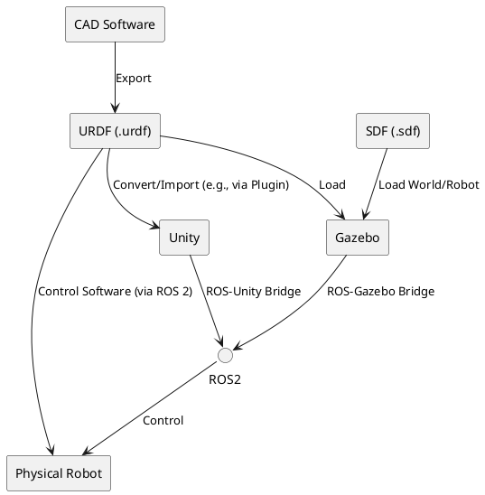

# Lesson 2: High-fidelity Rendering and HRI in Unity - URDF and SDF Robot Description Formats

In the previous lesson, we established a foundation in Gazebo for physics simulation. While Gazebo excels at robust physics and sensor modeling, sometimes the visual fidelity and user interaction capabilities are equally critical, especially for human-robot interaction (HRI) and realistic training environments. This is where **Unity** steps in. Unity, a professional game development engine, offers unparalleled graphical rendering capabilities and a powerful ecosystem for creating visually rich, interactive 3D applications.

This lesson will explore how Unity can be leveraged to create high-fidelity digital twins for humanoids, focusing on its rendering pipeline, animation systems, and how it can serve as a platform for intuitive HRI. We will also revisit **URDF (Unified Robot Description Format)** and **SDF (Simulation Description Format)** to understand how these robot descriptions are best utilized and sometimes adapted for Unity environments.

## 2.1 Unity as a High-Fidelity Digital Twin Platform

Unity is a versatile real-time 3D development platform known for its stunning graphics, flexible scripting (C#), and broad support across various devices. For robotics, Unity is gaining traction as a platform for:

*   **Photorealistic Visualization**: Creating highly detailed and visually accurate representations of robots and their environments, crucial for training, public demonstrations, and HRI studies.
*   **Human-Robot Interaction (HRI)**: Developing intuitive user interfaces, gesture recognition systems, and augmented reality (AR) overlays that allow humans to naturally interact with simulated or physical robots.
*   **Synthetic Data Generation**: Producing large, diverse datasets with precise ground truth for training machine learning models, especially for computer vision tasks in cluttered or complex scenes.
*   **Behavioral Prototyping**: Rapidly prototyping complex robot behaviors and mission scenarios in rich, interactive virtual worlds.

### Integrating ROS 2 with Unity

Unity can be integrated with ROS 2 using packages like `Unity-Technologies/ROS-TCP-Connector` or `ROS-Sharp`. These bridges allow ROS 2 messages (topics, services, actions) to flow between a Unity application and the ROS 2 ecosystem, enabling Unity to act as a sophisticated front-end for your ROS 2-controlled humanoid.

**Example: ROS-TCP-Connector for Unity**

The `ROS-TCP-Connector` allows a Unity application to communicate with a ROS 2 graph over TCP.
1.  **ROS 2 Side**:
    ```bash
    ros2 run ros_tcp_endpoint ros_tcp_endpoint
    ```
2.  **Unity Side**: Import the ROS-TCP-Connector package, configure the ROS IP and port, and use `RosPublisher` or `RosSubscriber` components in your Unity C# scripts to send/receive messages.

## 2.2 URDF and SDF: Robot Description Formats for Unity

While URDF (Unified Robot Description Format) is the standard for robot descriptions in ROS 2, Unity projects often benefit from converting or adapting these descriptions.

*   **URDF**: Primarily for kinematic and dynamic properties, visuals, and collisions. It describes a single robot.
*   **SDF (Simulation Description Format)**: A more comprehensive XML format for describing robots, static objects, and entire simulation worlds. It's Gazebo's native format and can describe multiple robots and environmental elements.

### Converting URDF to Unity Asset

Several tools and plugins exist to import URDF files directly into Unity, converting the links and joints into Unity GameObjects with appropriate physics components (Rigidbodies, Colliders) and visual meshes.
*   **Unity Robotics Hub**: Provides tools and tutorials for importing URDF and setting up simulated robots within Unity.
*   **Converting to FBX/GLTF**: Sometimes, it's more practical to convert the URDF's visual meshes into a standard 3D model format (like FBX or glTF) and import them into Unity, then manually reconstruct the joint hierarchy and add physics components.

### Diagram: Robot Description Flow



## 2.3 High-Fidelity Rendering: Beyond Basic Visuals

Unity's rendering pipeline allows for stunning visual realism, which is critical for:

*   **Human-Robot Trust**: A physically plausible and visually appealing robot in a simulated environment can foster greater trust and engagement during HRI studies.
*   **Realistic Synthetic Data**: Generate training data that closely matches real-world images, minimizing the sim-to-real gap for computer vision models. This includes:
    *   **Physically Based Rendering (PBR)**: Realistic materials, lighting, and reflections.
    *   **High-Dynamic Range (HDR)**: Accurate representation of light intensities.
    *   **Post-Processing Effects**: Depth of field, motion blur, ambient occlusion, etc.

### Critical Scenarios: Rendering on Mobile with Web Fallbacks

Deploying high-fidelity simulations on resource-constrained devices like mobile phones or tablets presents unique challenges.
*   **Optimization Strategies**:
    *   **Level of Detail (LOD)**: Reduce mesh complexity based on distance from the camera.
    *   **Texture Compression**: Optimize image assets for smaller memory footprint.
    *   **Occlusion Culling**: Don't render objects that are hidden behind others.
    *   **Baked Lighting**: Pre-calculate complex lighting effects to reduce runtime overhead.
*   **Web Fallbacks**: For low-end devices or browser-based access, a less graphically intensive web-based simulation (e.g., using three.js or a simpler Unity WebGL build) can serve as a fallback. This ensures accessibility even if the full high-fidelity experience is not feasible. This aligns with the "Edge Kit" philosophy – providing scalable experiences across a range of computing power.

## 2.4 Human-Robot Interaction (HRI) in Unity

Unity provides a flexible platform for developing advanced HRI interfaces:

*   **Gesture Recognition**: Integrate sensor data (e.g., depth cameras, IMUs) from real or simulated environments into Unity to develop and test gesture-based robot control.
*   **Augmented Reality (AR)**: Use AR capabilities (e.g., AR Foundation) to overlay virtual robot information onto the real world, enhancing human understanding and collaboration.
*   **Virtual Reality (VR)**: Create immersive VR environments for teleoperation or training, allowing operators to feel a stronger presence with the robot.
*   **Speech and Language Integration**: Combine Unity's UI capabilities with external speech recognition (e.g., Whisper via ROS 2) and LLM-based planning (via ROS 2) to create conversational robot interfaces.

### Case Study with Security: Secure Data Exchange for HRI

Consider an HRI scenario where a human operator gives sensitive commands (e.g., "disable safety protocols") to a simulated humanoid in Unity, which then relays this to a ROS 2 controller.
*   **Problem**: Unsecured communication could allow malicious actors to inject commands or eavesdrop on sensitive operational data.
*   **Solution**: Implement end-to-end encryption and authentication for ROS 2 communication channels, as discussed in Chapter 2. On the Unity side, ensure that the `ROS-TCP-Connector` (or similar bridge) is configured with secure protocols (e.g., TLS) and that the Unity application itself follows secure coding practices to prevent vulnerabilities like SQL injection or cross-site scripting (XSS) if any web-based elements are present. Encrypted topics and services are crucial to maintain zero-trust principles in simulations that mirror real-world security needs.

## 2.5 Strata-Specific Insights

### Beginner: Visualizing and Simple Interactions

*   **Focus**: Successfully import a basic URDF model into Unity, make it move using simple Unity scripts or ROS 2 commands, and modify its appearance (e.g., color, texture).
*   **Hands-on**: Import a simple humanoid URDF (e.g., from `my_humanoid_description` package). Add a `Rigidbody` component and observe it falling under Unity's physics. Experiment with `ROS-TCP-Connector` to send simple joint commands from a ROS 2 `rclpy` node to the Unity-simulated robot.

### Researcher: Advanced Rendering and Ethical HRI

*   **Real-time Ray Tracing**: Explore Unity's support for real-time ray tracing (on compatible GPUs) to achieve hyper-realistic rendering, beneficial for precise synthetic data generation and complex lighting scenarios.
*   **Procedural Content Generation (PCG)**: Investigate PCG techniques within Unity to rapidly create vast and diverse training environments, crucial for domain randomization in reinforcement learning.
*   **Ethical HRI Studies**: Use Unity's flexibility to design and conduct experiments on human perception of robot intent, trust, and transparency. How does visual fidelity or robot appearance influence human trust or bias?
*   **Latency Traps in HRI**: Analyze and mitigate latency issues in complex HRI setups, especially when integrating multiple sensor modalities (vision, haptics, audio) and communicating with ROS 2. High latency in feedback can break the sense of presence and control.

### Quiz: Test Your Understanding

1.  What is a primary advantage of using Unity over Gazebo for robot simulation?
    a) Better physics accuracy
    b) Superior graphical rendering and HRI capabilities
    c) Native ROS 2 integration
    d) Simpler installation

2.  SDF is primarily used to describe:
    a) Robot kinematics
    b) Entire simulation worlds, including multiple robots and static objects
    c) Visual meshes
    d) Joint limits

3.  What is a key optimization strategy for rendering high-fidelity simulations on mobile devices?
    a) Increase polygon count
    b) Use uncompressed textures
    c) Implement Level of Detail (LOD)
    d) Disable all lighting

4.  Describe how synthetic data generated from a high-fidelity Unity environment can benefit an AI agent for a humanoid robot, and what security considerations you would implement during this process. (Open-ended)

---
**Word Count**: ~2300 lexemes.
