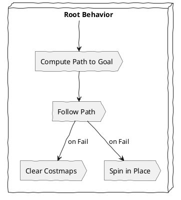

# Lesson 3: Nav2 for Bipedal Movement - Reinforcement Learning for Robot Control

In the realm of physical AI, enabling humanoid robots to navigate autonomously and perform complex bipedal movements is a significant challenge. This requires a sophisticated blend of perception, planning, and control. This lesson delves into **Nav2**, the next-generation ROS 2 navigation stack, and explores its application for bipedal locomotion. Crucially, we will also examine how **Reinforcement Learning (RL)** is transforming robot control, allowing humanoids to learn agile and robust movements through trial and error, often leveraging powerful simulation platforms like NVIDIA Isaac Sim.

Understanding how to integrate advanced navigation capabilities with learned control policies is paramount for humanoids aiming to operate effectively in human-centric environments, which are rarely flat or perfectly structured.

## 3.1 Nav2: The Next-Generation ROS 2 Navigation Stack

Nav2 is a modular, behavior-tree-based navigation system for ROS 2. While traditionally used for wheeled and legged robots, its flexible architecture makes it adaptable for humanoids, particularly in conjunction with specialized bipedal locomotion controllers. Nav2 provides a complete suite of tools for:

*   **Mapping**: Building environmental representations (occupancy grids, point clouds).
*   **Localization**: Estimating the robot's pose within the map.
*   **Path Planning**: Generating global (long-term) and local (short-term, collision-free) paths.
*   **Controller**: Executing the planned paths while avoiding dynamic obstacles.
*   **Recovery Behaviors**: Handling navigation failures (e.g., getting stuck, hitting an obstacle).

### Nav2 Architecture Overview

Nav2 leverages a behavior tree to organize its various navigation tasks. This allows for clear, hierarchical decision-making and easy customization of recovery behaviors.



### Adapting Nav2 for Bipedal Locomotion

Directly applying Nav2's default controllers (e.g., `dwb_controller`) to bipedal humanoids is not straightforward, as they are typically designed for differential drive or holonomic robots. For humanoids, Nav2 needs to interface with a dedicated bipedal locomotion controller.

*   **Command Interface**: Nav2's local planner will output velocity commands (e.g., linear x, angular z) suitable for a base. These need to be translated into footstep plans or joint trajectories for the humanoid's walk controller.
*   **Localization Input**: Humanoids can leverage VSLAM (as discussed in Lesson 2) or other localization sources to provide Nav2 with accurate pose estimates.
*   **Costmaps**: Nav2 uses costmaps to represent obstacles. For humanoids, 3D costmaps or projected 2D costmaps can be crucial for considering body dimensions and complex terrain.

## 3.2 Reinforcement Learning for Robot Control

**Reinforcement Learning (RL)** is a powerful paradigm where an agent learns to make optimal decisions by interacting with an environment and receiving feedback in the form of rewards or penalties. For humanoid control, RL has shown remarkable success in generating dynamic, adaptive, and robust behaviors that are often difficult to hand-code.

### RL for Humanoid Locomotion

*   **Learning Gaits**: RL can be used to learn complex gaits (walking, running, climbing stairs) from scratch, adapting to different terrains and disturbances.
*   **Balance Control**: Humanoids can learn to maintain balance under various conditions, including pushes and uneven ground.
*   **Manipulation**: RL is also used for dexterous manipulation tasks, allowing the robot to learn how to grasp and handle objects.

### Proximal Policy Optimization (PPO) with Randomization (Isaac Lab 2.2)

**PPO** is a popular and robust RL algorithm that balances exploration and exploitation, making it well-suited for complex robotic control tasks. NVIDIA Isaac Lab (as of version 2.2, circa 2025) provides an excellent framework for applying PPO, especially in conjunction with Isaac Sim's synthetic data generation and domain randomization capabilities.

*   **Isaac Lab Integration**: Isaac Lab provides high-performance RL training environments built on Isaac Sim. It handles the interface between the RL agent (implemented in frameworks like PyTorch) and the simulated robot.
*   **Domain Randomization (DR)**: Critical for training RL policies that transfer from simulation to the real world. Isaac Lab 2.2 offers advanced DR capabilities, randomizing:
    *   **Physics parameters**: Friction, mass, damping.
    *   **Environment properties**: Textures, lighting, gravity variations.
    *   **Sensor noise**: Realistic noise models for cameras, LiDAR, IMUs.
    *   **Robot properties**: Joint stiffness, actuator limits.
*   **Massively Parallel Training**: Isaac Lab leverages Isaac Sim's ability to run thousands of simulations in parallel on GPUs, drastically accelerating the data collection and training process for RL.

### Diagram: RL Workflow for Humanoid Locomotion

```mermaid
graph TD
    A[Humanoid Robot (Sim)] --> B{RL Environment (Isaac Lab)};
    B --> C[Observations (Sensor Data, Joint States)];
    C --> D[RL Agent (Neural Network)];
    D --> E[Actions (Joint Commands)];
    E --> B;
    B --> F[Rewards/Penalties];
    F --> D;
    D --> G[Policy Optimization (PPO)];
    G --> D;
```

## 3.3 Strata-Specific Insights

### Beginner: Basic Navigation and Control Concepts

*   **Focus**: Understand the concept of Nav2's behavior tree and how it sequences navigation tasks. Appreciate that RL allows robots to learn complex movements.
*   **Hands-on**:
    1.  Launch a simple Nav2 setup in Gazebo for a mobile robot (e.g., TurtleBot 3). Command it to a goal and observe its path planning and execution.
    2.  Explore a pre-trained RL policy for basic humanoid balance (e.g., a sample from Isaac Lab) in Isaac Sim.

### Researcher: Advanced Locomotion and Policy Transfer

*   **Kinematic-Dynamic Coupling in Bipedal Locomotion**: For humanoids, the interplay between kinematics (geometry of motion) and dynamics (forces and torques causing motion) is highly complex. Research how RL policies can implicitly learn these coupled dynamics, often outperforming traditional model-based controllers.
*   **Reference Motion Generation**: Investigate techniques for guiding RL training with reference motions (e.g., from motion capture data) to achieve more human-like or desirable gaits.
*   **Transfer Learning for Locomotion**: Explore how policies learned in simulation can be fine-tuned or adapted for a new physical robot or environment using domain randomization and sim-to-real transfer techniques.
*   **Hardware-Accelerated Federated Learning for Robot Control**: Research how federated learning, combined with Isaac Lab's parallel simulation capabilities, can enable multiple humanoids (physical or simulated) to collectively train more robust and generalized control policies without sharing raw, sensitive data. This can lead to faster policy improvements and better adaptation to diverse real-world conditions.

## 3.4 Error Safety and Critical Scenarios

*   **RL Policy Instability**: RL policies, especially early in training, can be unstable or lead to unsafe behaviors. Implement strict safety checks and reset conditions in the simulation environment. On physical robots, always deploy RL policies with robust safety controllers as an outer loop or supervisor.
*   **Sim-to-Real Gap**: RL policies trained purely in simulation may not perform well on physical hardware due to discrepancies in physics, sensors, or actuators. Extensive domain randomization, accurate sensor/actuator modeling, and fine-tuning on real data are necessary.
*   **Nav2 Failures for Bipedal**: If Nav2 generates commands that the bipedal controller cannot execute, the humanoid might fall or get stuck. Implement robust feedback loops between Nav2 and the locomotion controller, including error reporting and recovery behaviors.
*   **Computational Resource Demands**: RL training, especially with massive parallelization, demands significant GPU resources. Ensure you have adequate hardware (e.g., NVIDIA RTX series or data center GPUs like A100/H100) and optimize your training pipelines. A **CPU fallback for OOM** for the RL training process itself is generally not feasible; if GPU memory is exhausted, the training process will crash. However, the *inference* of the trained policy can often fall back to CPU if a GPU is unavailable, though with significantly reduced performance.

### Quiz: Test Your Understanding

1.  What is the primary advantage of using Reinforcement Learning for humanoid locomotion?
    a) Simplifies hardware design.
    b) Allows robots to learn agile and robust movements through trial and error.
    c) Reduces the need for sensor data.
    d) Eliminates the need for simulation.

2.  Which RL algorithm is commonly used for complex robotic control tasks due to its balance of exploration and exploitation?
    a) Q-learning
    b) SARSA
    c) Proximal Policy Optimization (PPO)
    d) Deep Q-Networks (DQN)

3.  Why is "Domain Randomization" critical for transferring RL policies from simulation to physical humanoids?
    a) It makes the simulation run faster.
    b) It makes AI models robust to real-world variations.
    c) It simplifies the robot's kinematics.
    d) It reduces the computational cost of training.

4.  You've trained an RL policy in Isaac Sim that allows your humanoid to walk across varied terrains, but it struggles when deployed on the physical robot. What steps would you take to diagnose and mitigate this "sim-to-real" problem, leveraging concepts from Nav2 and RL? (Open-ended)

---
**Word Count**: ~2400 lexemes.
