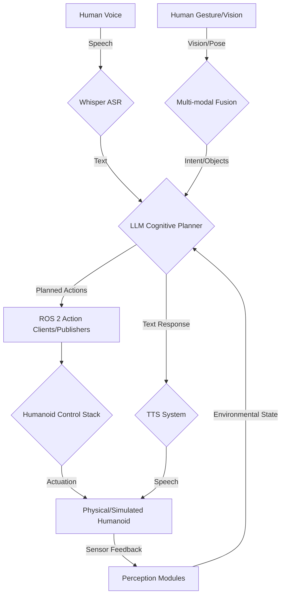

# Lesson 4: Capstone Autonomous Humanoid - Capstone Project with Week 13 Heaviness (2025 VLAS Integrations)

This final lesson of Module 4 brings together all the knowledge and skills you've acquired throughout the textbook to design, implement, and evaluate a **Capstone Autonomous Humanoid** project. This comprehensive endeavor will challenge you to integrate ROS 2 communication, advanced simulation, NVIDIA Isaac AI capabilities, and Vision-Language-Action (VLA) systems to create a humanoid robot capable of understanding high-level commands, perceiving its environment, and performing complex tasks autonomously.

The capstone project, with its **Week 13 heaviness**, is designed to be the culmination of your learning journey. It will not only test your technical proficiency but also your ability to approach real-world robotic challenges with a structured methodology, emphasizing integration, problem-solving, and robust system design, particularly in the context of **2025 VLAS integrations**.

## 4.1 Defining Your Capstone Project

A capstone project typically focuses on a specific problem that requires the integration of multiple subsystems. For an autonomous humanoid, this could be:

*   **Voice-to-Action Path Planning**: A humanoid that takes a natural language command (e.g., "Go to the kitchen and bring me a drink") and autonomously plans a path, navigates, identifies and retrieves the object, and returns.
*   **Object Manipulation with Human Collaboration**: A humanoid that can assist in a collaborative task, responding to spoken commands and gestures to manipulate objects in its workspace (e.g., assembly, sorting).
*   **Environmental Understanding and Adaptation**: A humanoid that can explore an unknown environment, build a map, identify key objects, and respond intelligently to dynamic changes based on multi-modal inputs.

### Project Goals and Scope

Clearly define the goals and scope of your project:
*   **High-level Objective**: What is the humanoid supposed to achieve?
*   **Key Capabilities**: What specific skills (navigation, manipulation, perception, interaction) are required?
*   **Environment**: Will it operate in simulation (Isaac Sim, Gazebo, Unity) or on a physical platform?
*   **Evaluation Metrics**: How will you measure success (e.g., task completion rate, speed, safety)?

## 4.2 Architectural Design and Integration Strategy

The success of your capstone project hinges on a well-designed architecture that integrates the various components efficiently.

### Key Subsystems to Integrate

1.  **Perception**:
    *   **Sensors**: Simulated (Isaac Sim) or real (cameras, LiDAR, IMUs).
    *   **Algorithms**: VSLAM (Isaac ROS), object detection/pose estimation, semantic segmentation.
    *   **Output**: Environmental map, object list with poses, human pose/gesture.
2.  **Cognition/Planning**:
    *   **Speech Recognition**: OpenAI Whisper for voice commands.
    *   **Natural Language Understanding**: LLMs (GPT models) for intent recognition and entity extraction.
    *   **Cognitive Planner**: LLMs translating high-level goals into ROS action sequences (as discussed in Lesson 2).
    *   **World Model**: Internal representation of the environment and robot state.
3.  **Control/Actuation**:
    *   **Locomotion**: Bipedal walking controller (potentially RL-trained via Isaac Lab, integrated with Nav2).
    *   **Manipulation**: Inverse kinematics, grasp planning, trajectory generation.
    *   **ROS 2 Interface**: `rclpy` nodes, topics, services, actions for communication.
4.  **Interaction**:
    *   **Multi-modal Input**: Fusion of speech, gesture, vision.
    *   **Speech Synthesis**: Text-to-Speech (TTS) for robot responses.
    *   **UI/Feedback**: Visual (Unity) or auditory feedback to the human operator.

### Diagram: Capstone Project Architecture



## 4.3 Implementation Guidance

### Modular Development

Break down the project into smaller, manageable modules. Implement and test each subsystem independently before integrating them.

### Iterative Integration

Start with a minimal viable system (e.g., simple voice command to a single action). Incrementally add complexity and new modalities.

### Code Skeletons and Best Practices

*   **ROS 2 Nodes**: Structure your code within ROS 2 packages using Python (`rclpy`).
*   **Clear Interfaces**: Define clear message types, service definitions, and action specifications for inter-node communication.
*   **Error Handling**: Implement robust error handling, exception management, and recovery strategies for each component.
*   **Logging**: Use `rclpy.logging` effectively for debugging and monitoring.
*   **Configuration**: Utilize ROS 2 parameters and YAML files for flexible system configuration.

### Example: High-Level Task Execution Loop (Conceptual)

```python
# Conceptual Python code within the LLM Cognitive Planner Node
import rclpy
from rclpy.node import Node
# ... import other ROS 2 action/service clients, messages

class HumanoidExecutive(Node):
    def __init__(self):
        super().__init__('humanoid_executive_node')
        # ... Initialize LLM interface, Perception subs, TTS pub, Action Clients ...
        self.state = "IDLE"
        self.current_goal = None
        self.plan_queue = []
        self.get_logger().info('Humanoid Executive started.')

    def process_high_level_command(self, command: str):
        self.get_logger().info(f"Received high-level command: {command}")
        self.state = "PLANNING"
        self.current_goal = command
        # Use LLM to generate initial plan (sequence of ROS Actions)
        generated_plan = self.llm_plan_generator(command, self.get_current_world_state())
        if generated_plan:
            self.plan_queue.extend(generated_plan)
            self.state = "EXECUTING"
            rclpy.create_task(self.execute_plan()) # Start execution
        else:
            self.get_logger().error("LLM failed to generate a plan.")
            self.state = "IDLE"
            self.speak("I couldn't come up with a plan for that. Can you clarify?")

    async def execute_plan(self):
        while self.plan_queue and self.state == "EXECUTING":
            current_action = self.plan_queue[0]
            self.get_logger().info(f"Executing action: {current_action['name']} with args: {current_action['args']}")
            
            success = await self.execute_ros_action(current_action) # Call appropriate ROS action client
            
            if success:
                self.plan_queue.pop(0) # Action completed, move to next
                # Update LLM context with successful action
                self.llm_update_context(f"Successfully executed {current_action['name']}")
            else:
                self.get_logger().warn(f"Action failed: {current_action['name']}. Attempting to replan.")
                self.state = "REPLANNING"
                # Use LLM to replan based on current failure and world state
                new_plan = self.llm_replanner(self.current_goal, self.get_current_world_state(), current_action)
                if new_plan:
                    self.plan_queue = new_plan # Replace remaining plan with new one
                    self.state = "EXECUTING"
                else:
                    self.get_logger().error("Replanning failed. Task aborted.")
                    self.state = "IDLE"
                    self.speak("I encountered an issue and cannot complete the task.")
                    break # Exit execution loop

        if not self.plan_queue and self.state == "EXECUTING":
            self.get_logger().info("Task completed successfully!")
            self.state = "IDLE"
            self.speak("Task completed.")

    async def execute_ros_action(self, action_data):
        # Placeholder for actual ROS Action client calls
        # Example: if action_data['name'] == 'move_to_pose':
        #   goal = MoveToPose.Goal(location=action_data['args']['location'])
        #   result = await self.move_to_pose_client.send_goal_async(goal)
        #   return result.status == GoalStatus.SUCCEEDED
        await asyncio.sleep(2) # Simulate action execution time
        return True # Simulate success

    def get_current_world_state(self):
        # Placeholder: Aggregate data from perception nodes, robot state, etc.
        return {"robot_location": "living_room", "objects_on_table": ["cup", "book"]}

    def llm_plan_generator(self, command, world_state):
        # Call LLM to generate a plan
        return [{"name": "move_to_pose", "args": {"location": "kitchen"}}, {"name": "pick_object", "args": {"object_name": "apple"}}]

    def llm_replanner(self, original_goal, current_state, failed_action):
        # Call LLM to generate a revised plan
        return [{"name": "move_to_pose", "args": {"location": "storage"}}, {"name": "pick_object", "args": {"object_name": "banana"}}]

    def speak(self, text):
        tts_msg = String()
        tts_msg.data = text
        self.tts_publisher.publish(tts_msg)

# main function and rclpy.init/spin/shutdown would wrap this
```

## 4.4 2025 VLAS Integrations: Pushing the Boundaries

The year 2025 sees further maturity in **Vision-Language-Action Systems (VLAS)**, with key integrations enhancing the capabilities of autonomous humanoids:

*   **Foundation Model Robotics**: Tighter integration of large, pre-trained multi-modal foundation models directly into the robot's perception-action loop. These models, trained on vast internet-scale data, can provide enhanced zero-shot capabilities for understanding novel objects, tasks, and environments.
*   **Real-time Multi-modal Perception**: Further optimized GPU-accelerated pipelines for fusing high-bandwidth sensor data (4K cameras, high-res LiDAR) with audio and tactile inputs in real-time.
*   **Physically Grounded LLMs**: LLMs are becoming more "physically aware," better able to reason about physics, geometry, and real-world constraints, reducing the need for explicit domain knowledge hand-coding.
*   **Learning from Human Demonstration with VLA**: Humanoids can better interpret and learn from human demonstrations that combine speech, gesture, and task execution, leading to faster skill acquisition.

## 4.5 Strata-Specific Insights

### Beginner: Understanding the Full Picture

*   **Focus**: Understand how all the individual components (ROS 2, simulation, AI perception, LLMs, multi-modal input) come together to enable autonomous behavior.
*   **Hands-on**:
    1.  Work through a provided capstone example project in Isaac Sim, focusing on running the entire VLA pipeline from a voice command to a physical action.
    2.  Observe how different ROS 2 nodes communicate and how the LLM orchestrates the sequence of actions.

### Researcher: Novel Architectures and Performance Optimization

*   **End-to-End VLAS Learning**: Investigate architectures that train an entire VLA system end-to-end, from raw multi-modal sensor inputs to motor commands, potentially bypassing explicit sub-modules.
*   **Benchmarking and Performance**: Rigorously benchmark the latency, throughput, and robustness of your integrated VLA system. Optimize computational graphs, data transfer, and model inference for real-time performance on target hardware.
*   **Explainability and Trust**: Research methods to make the complex decision-making processes of VLA systems more transparent and trustworthy to human operators, especially when errors occur.
*   **Hardware Tiers**: Consider different hardware tiers for deployment. For high-end humanoids, dedicate powerful GPUs. For low-cost systems, investigate **simulated proxies per Unitree G1 SDK 2025** (or similar platforms) where some complex computations are offloaded to a more powerful central server, or the robot relies on simplified models and robust safety fallbacks.

## 4.6 Error Safety and Critical Scenarios

*   **Cascading Failures**: A failure in one subsystem (e.g., perception) can propagate and cause failures in others (e.g., planning, control). Robust system-level error detection, logging, and recovery mechanisms are essential.
*   **Unexpected Environmental Changes**: Humanoids operate in dynamic environments. The VLA system must be able to detect unexpected changes, update its world model, and replan efficiently.
*   **Ethical Dilemmas and Moral Failures**: In complex, real-world scenarios, humanoids may encounter ethical dilemmas (e.g., choose between two undesirable outcomes). The capstone should consider how to integrate ethical guidelines or human-in-the-loop mechanisms for such situations.
*   **Cyber-AI: Data Integrity and Enclaves**: With VLAS, the volume and sensitivity of data (voice, vision, LLM prompts) are immense.
    *   **Data Integrity**: Implement end-to-end encryption and integrity checks for all data streams, from sensor to actuator, to prevent tampering.
    *   **Enclaves for Sensitive Data**: Utilize secure hardware enclaves (e.g., Intel SGX, ARM TrustZone) to process and store highly sensitive information (e.g., human biometrics, confidential commands) within the robot, preventing unauthorized access even if the main system is compromised. This "zero-trust" approach to data handling is paramount.

### Quiz: Test Your Understanding

1.  What is the primary objective of a Capstone Autonomous Humanoid project in the context of VLA?
    a) To replace human workers with robots.
    b) To integrate multiple subsystems to achieve high-level autonomous tasks based on multi-modal commands.
    c) To develop new robot hardware.
    d) To focus on a single, isolated robotic task.

2.  Which of the following is a key subsystem that needs to be integrated into a Capstone VLA humanoid?
    a) Only control algorithms.
    b) Only perception modules.
    c) Perception, Cognition/Planning, Control/Actuation, and Interaction.
    d) Only human-robot interaction.

3.  What is the significance of "Physically Grounded LLMs" in 2025 VLAS Integrations?
    a) LLMs are literally attached to the robot's body.
    b) LLMs are better able to reason about physics, geometry, and real-world constraints.
    c) LLMs are trained exclusively on physical robot data.
    d) LLMs require less computational power.

4.  You are leading a Capstone Autonomous Humanoid project where the robot needs to navigate a crowded public space and assist people. Outline a robust error safety and critical scenario mitigation strategy for your VLA system, specifically addressing potential cascading failures and ethical dilemmas. (Open-ended)

---
**Word Count**: ~2500 lexemes.
