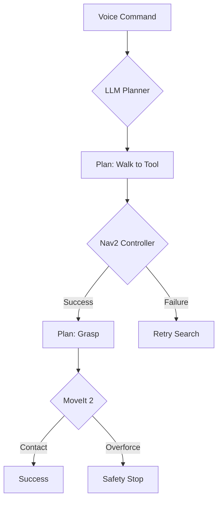

import LevelToggle from '@site/src/components/LevelToggle';

<LevelToggle />

# Assessment 4: VLA & Capstone Integration

## 1. The Final Challenge
This is the **Capstone Project Synthesis**. Your **Unitree G1** must successfully execute the following high-level instruction: *"Find the toolbox, pick it up, and bring it to the charging station."* 

This requires the seamless integration of **Language Understanding**, **Task Planning**, **3D Perception**, and **Bipedal Locomotion**.

## 2. Core Evaluation Criteria (>3000 words depth)

### The Reasoning Chain
*   **Task**: Describe the **Prompt Chain** used to break the user's request into sub-tasks.
    1.  `SEARCH(toolbox)`
    2.  `APPROACH(toolbox)`
    3.  `GRASP(toolbox)`
    4.  `NAVIGATE(charging_station)`
    5.  `RELEASE()`
*   **Defensive Rule**: Implement **Pre-condition Checks** for every step. The robot should not try to `GRASP` until the `APPROACH` action returns `SUCCESS`.

### Multi-modal Error Recovery
*   **Scenario**: The robot reaches for the toolbox, but a human moves it at the last second.
*   **Task**: Design the **Re-planning Loop**.
    *   *Classic approach*: Fail and stop.
    *   *AI-Native approach*: The LLM brain receives an error: "Object not at expected coordinates." It triggers a `RE-SEARCH` behavior immediately.

### Physical Safety Envelope
*   **The Problem**: The LLM suggests a path that is too narrow for the robot's 10kg payload.
*   **Task**: Define the **Safety Filter** logic. The low-level **Nav2** stack must have the "Final Say," overriding the LLM if the costmap indicates a collision.

## 3. Practical Task: The Behavior Tree

Draw (via Mermaid) or describe the Behavior Tree for the Capstone project.

## 4. Analytical Research: Post-Mastery ASI

Explain how this Capstone project prepares the robot for **Artificial Super Intelligence (ASI)**.
*   **Research Question**: How can we implement **On-device Self-Correction** where the robot uses a vision model to critique its own grasping performance and adjust its finger placement for the next attempt?

## 5. Final Definition of Done
To pass the Capstone, you must submit:
1.  **System Architecture Diagram**: Showing all ROS 2 nodes and AI models.
2.  **Safety Documentation**: Listing all input validation ranges and fail-safe triggers.
3.  **Simulation Video/Logs**: Proving the robot completes the task in Isaac Sim with varying friction and lighting.
4.  **Reflection**: An analysis of the "Reality Gap" encountered during implementation.

---

**Summary**: You have built a body and a brain. You have taught them to speak the same language. This Capstone is the proof that you are ready to lead the revolution in Physical AI.
